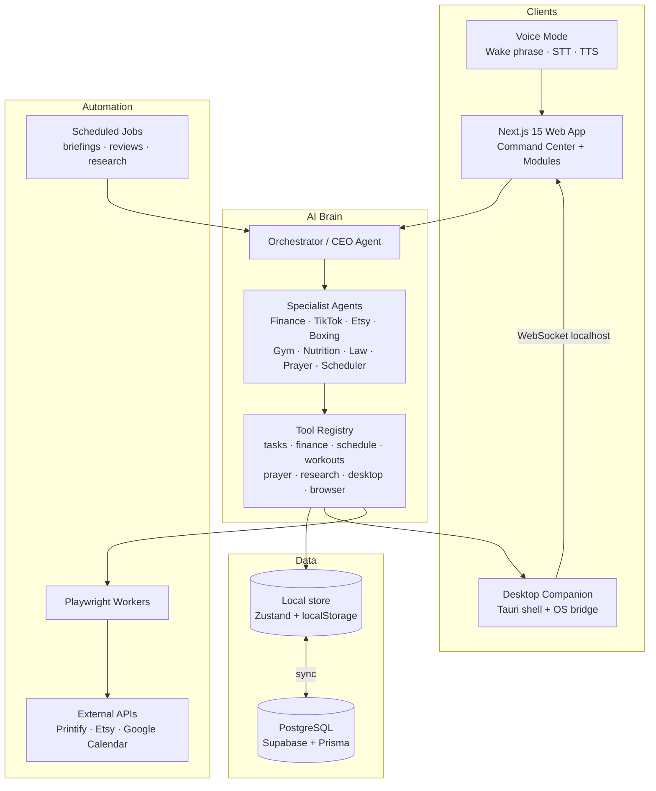
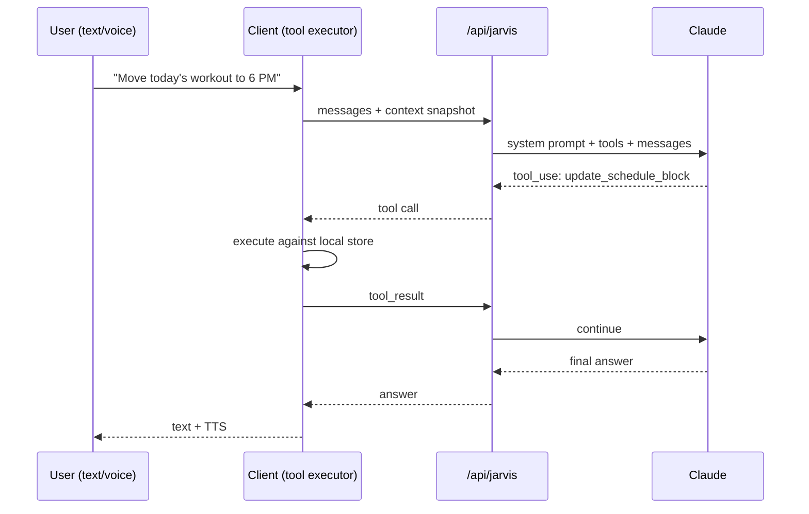

# 01 — Overall Software Architecture

JARVIS is a layered system: a premium web app (the cockpit), an AI brain (agent swarm with tool use), a data layer (local-first, cloud-synced), a desktop bridge (OS control), and an automation layer (browser + scheduled jobs).

## System overview



## Layers

### 1. Presentation — the cockpit
- **Next.js 15 App Router**, React 19, TypeScript, Tailwind v4, Framer Motion, Recharts.
- One shell layout: keyboard-first sidebar, dark-mode-first, Linear/Raycast-grade minimalism.
- Every life pillar is a module route (`/money`, `/boxing`, `/islam`, …) sharing one design system.

### 2. AI Brain — the operator
- `/api/jarvis` runs an **agentic tool-use loop** against Claude (falls back to a deterministic local planner when no API key is configured).
- The model decides which tools to call; **tool execution happens client-side** against the user's own data store, then results are fed back to the model. The server never holds personal data.
- The Orchestrator routes intent to specialist agents (see `03-agent-architecture.md`).



### 3. Data — local-first, cloud-ready
- **Today**: a single typed Zustand store persisted to localStorage. Zero setup, instant, private.
- **Production sync**: Prisma schema (`prisma/schema.prisma`) targeting Supabase PostgreSQL with row-level security; the store becomes a write-through cache with background sync and offline queue.

### 4. Desktop bridge — hands on the machine
- Tauri companion app exposes a **capability-scoped localhost WebSocket** (`ws://127.0.0.1:8377`).
- Commands: open/close apps, browse, screenshot, read screen (OCR/accessibility tree), mouse/keyboard, files, media, volume.
- Every command is tiered by risk; irreversible ones require confirmation. Details in `04-desktop-architecture.md`.

### 5. Automation — the workhorses
- Playwright workers for browser automation (research, form-filling, data extraction).
- Scheduled jobs (cron via Trigger.dev/n8n or local scheduler): morning briefing, nightly summary, weekly review, trend research, listing drafts.
- Native API integrations preferred over automation wherever they exist (Etsy, Printify, Google Calendar). Details in `05-automation-architecture.md`.

## The ROI engine

The heart of JARVIS. Every task, block, and suggestion carries a computed **ROI score**:

```
score = (impact × pillarWeight × urgency) / effortHours
```

- `pillarWeight` reflects the user's fixed priority order (wealth 10, business 9, boxing 8, law 8, fitness 7, islam 10*, self-improvement 6). *Prayers are non-negotiable anchors, not scored tasks — the scheduler plans around them.
- The scheduler fills the day highest-score-first into free blocks between anchors (prayers, school, sleep).
- Missed blocks automatically reflow to the next free slot.

## Non-functional requirements

| Concern | Approach |
|---|---|
| Privacy | Local-first data; server is a stateless LLM proxy; keys in env only |
| Latency | Optimistic UI, client-side tools, streaming responses |
| Reliability | App fully functional offline except LLM chat |
| Safety | Risk-tiered actions; confirmation gates on irreversible operations |
| Extensibility | New module = store slice + tool definitions + route |
