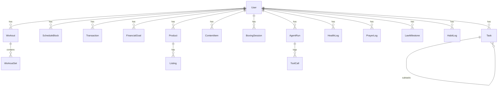

# 02 — Database Schema

The canonical schema lives in [`prisma/schema.prisma`](../prisma/schema.prisma) (PostgreSQL / Supabase). The local Zustand store mirrors these shapes in `src/lib/store.ts` so the future sync layer is a straight mapping.

## Entity-relationship overview

## Domain groups

### Core
- **User** — profile, location (for prayer times), calculation method, pillar weights.
- **Task** — title, notes, pillar, priority, ROI fields (impact, effortHours), deadline, recurrence rule, parent (subtasks), dependencies, status.
- **ScheduleBlock** — date, start/end, type (`prayer | deep_work | gym | boxing | school | business | study | sleep | meal | buffer`), linked task, completed/missed, rescheduledFrom.

### Money OS
- **Transaction** — amount, direction, category, source (`tiktok | etsy | other`), date, notes.
- **Account** — cash/bank/investment balances → net worth snapshots.
- **FinancialGoal** — target amount, horizon (monthly/quarterly/yearly), progress.
- **NetWorthSnapshot** — periodic computed totals for trend charts.

### Business
- **Product** — platform (`tiktok | etsy`), status (`research | testing | winning | killed | live`), cost, price, margin, supplier/Printify blueprint.
- **Listing** — Etsy: title, description, tags[13], SEO keywords, mockups, publish state, queue position.
- **ContentItem** — TikTok: hook, script, caption, scheduled date, posted, views/sales attribution.
- **CompetitorNote** — platform, handle/shop, observations, metrics.

### Boxing & Gym
- **BoxingSession** — type (`bag | pads | sparring | conditioning | roadwork | technique | defense`), duration, intensity, rounds, notes, coach feedback.
- **SkillRating** — jab, cross, hooks, uppercuts, footwork, head movement, defense, ring IQ, conditioning (0–10, tracked over time).
- **Workout / WorkoutSet** — exercise, sets, reps, weight, RPE; PR detection; weekly volume per muscle group.
- **FightPrep** — fight date, target weight, camp plan phases.

### Health
- **HealthLog** — daily: calories, protein, water, sleep hours, sleep quality, weight, body fat, mood, stress, energy → computed **readiness score**.

### Islam
- **PrayerLog** — date, prayer (fajr…isha), status (`on_time | late | missed | jamaah`), streak computation.
- **QuranLog** — date, surah/juz, pages/verses.
- **DhikrLog** — date, type, count.
- **Dua** — personal dua list.

### Law
- **LawMilestone** — phase (`high_school | college | lsat | applications | law_school | bar`), title, target date, status, resources.

### System
- **AgentRun** — agent, trigger, input, plan, outcome, duration.
- **ToolCall** — run id, tool, args, result, risk tier, confirmed by user.
- **AutomationJob** — schedule (cron), type, enabled, lastRun, lastResult.

## Sync strategy

1. Every row carries `id (uuid)`, `updatedAt`, `deletedAt` (soft delete).
2. Client keeps an offline mutation queue; last-write-wins per field on conflict, with server `updatedAt` as arbiter.
3. Supabase RLS: every table scoped by `userId = auth.uid()`.
