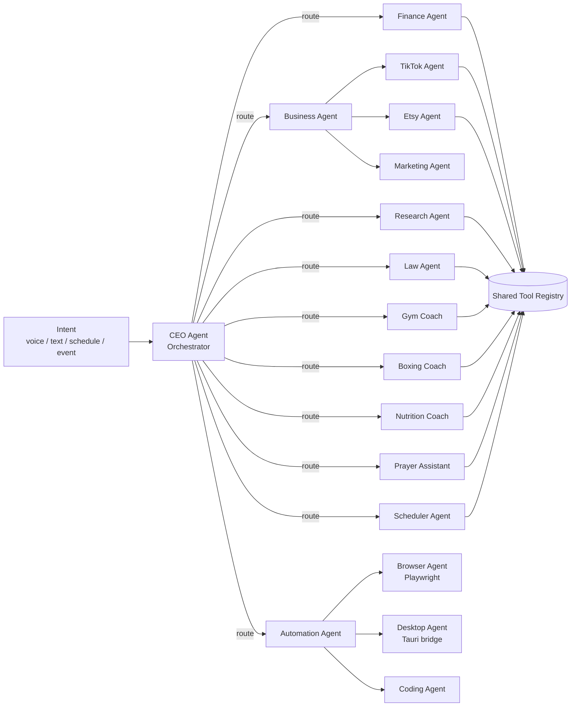

# 03 — Agent Architecture

JARVIS is a swarm of specialist agents coordinated by an Orchestrator (the CEO Agent). Every agent shares the same operating loop:

**Observe → Analyze → Reason → Plan → Choose tools → Execute → Verify → Improve → Log**

## Agent roster

| Agent | Mandate | Key tools |
|---|---|---|
| **CEO** | Owns the ROI question: "highest return on his time right now?" Routes intents, resolves conflicts between agents, produces morning briefing & nightly summary | all (via delegation) |
| **Finance** | Money OS: cash flow, budgets, forecasts, ROI calcs, tax set-asides | `get_finance_summary`, `add_transaction`, `set_goal` |
| **Business** | Portfolio view across ventures; allocates effort by profit-per-hour | finance + platform tools |
| **TikTok** | Winning-product research, scripts, captions, content calendar | `add_product`, `add_content`, `research` |
| **Etsy** | Listing generation (title/desc/13 tags), SEO, publish queue, Printify | `create_listing`, `queue_publish` |
| **Marketing** | Hooks, angles, offers, outreach drafts | content tools |
| **Research** | Deep dives: markets, competitors, trends | browser agent, web search |
| **Law** | Roadmap keeper: GPA, LSAT plan, reading/writing practice, applications | `update_milestone`, study tools |
| **Gym Coach** | Progressive overload programming, PR tracking, deload timing | `log_workout`, `recommend_workout` |
| **Boxing Coach** | Session plans, skill-gap analysis, fight-camp periodization | `log_boxing_session`, `rate_skill` |
| **Nutrition** | Calories/protein targets from goals + training load | `log_health` |
| **Prayer Assistant** | Prayer times, reminders, Qur'an/dhikr tracking, Ramadan mode | `get_prayer_times`, `log_prayer` |
| **Scheduler** | Builds the day around prayer anchors, ROI-ranks blocks, reflows missed ones | `generate_schedule`, `move_block` |
| **Automation** | Owns recurring jobs and delegates hands-on work | browser/desktop agents |
| **Browser** | Playwright execution: navigate, fill, extract, download | scoped browser actions |
| **Desktop** | OS control through the Tauri bridge | scoped desktop actions |
| **Coding** | Writes/repairs automation scripts | file + shell (sandboxed) |

## Implementation model

Agents are **not** separate processes. An agent = a system-prompt persona + a scoped subset of the tool registry + memory scope. The Orchestrator loop (implemented in `/api/jarvis`):

1. Build context: user profile, today's schedule, prayer times, open tasks, finance snapshot (client sends a compact snapshot — the server stores nothing).
2. Claude receives the CEO system prompt + full tool registry (each tool tagged with its owning agent).
3. Model plans and emits `tool_use` blocks; the client executes them against the local store and returns results.
4. Loop until final text; the exchange is logged as an `AgentRun` with `ToolCall` children.

**No-key fallback:** a deterministic local planner handles core intents (schedule generation, prayer queries, task CRUD, summaries) so JARVIS is useful without any API key.

## Memory

- **Working memory**: conversation messages (client-held).
- **Episodic**: `AgentRun` log — what was tried, what worked.
- **Semantic**: user profile + pillar weights + learned preferences (e.g. "prefers gym after Asr").
- **Review loops**: weekly review job mines the episodic log for patterns and updates semantic memory.

## Safety tiers

| Tier | Examples | Policy |
|---|---|---|
| **Low** | read data, create task, log workout, move schedule block | auto-execute |
| **Medium** | draft email, write file, create listing draft, browser navigation | auto-execute, visibly logged, undoable |
| **High** | send, publish, purchase, delete files, transfer money | **explicit confirmation required, every time** |

High-tier tools are physically separated in the registry: their executors throw unless a fresh user confirmation token accompanies the call. Confirmation is never cached across actions.
