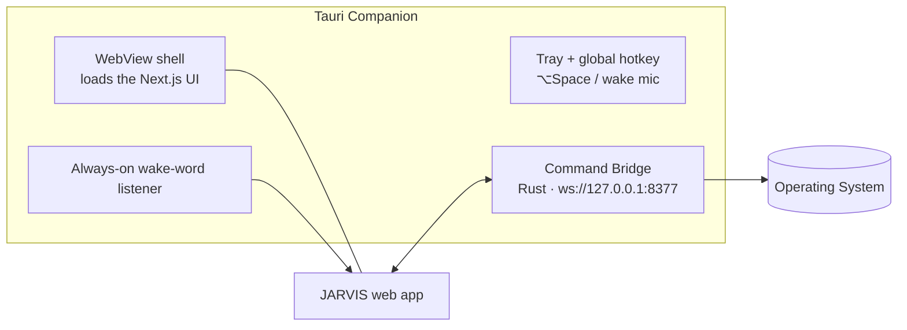
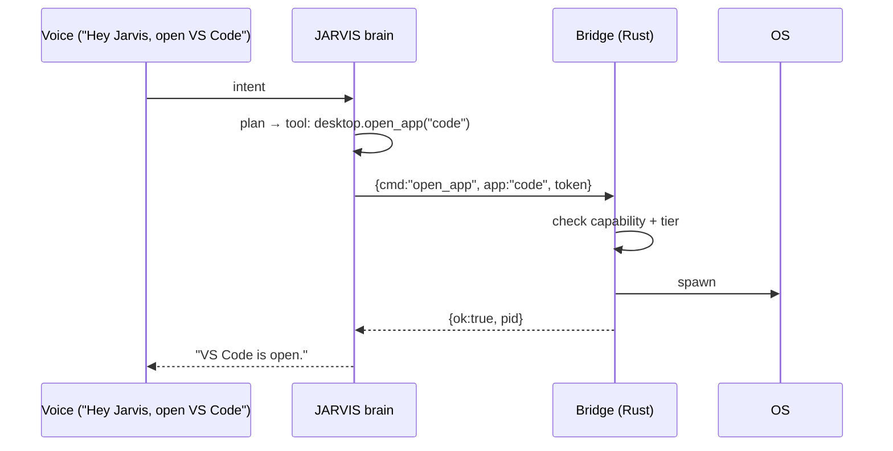

# 04 — Desktop Architecture

JARVIS controls the machine through a **desktop companion**: a Tauri app that (a) wraps the web UI in a native shell with global hotkey + always-on voice, and (b) exposes a capability-scoped bridge for OS control.

## Why Tauri (vs Electron)

- ~10 MB binary vs ~150 MB; far lower RAM — JARVIS is *always running*.
- Rust core = a real security boundary for the command bridge.
- Native OS APIs (global shortcuts, tray, notifications, autostart) built in.

## Topology

- The bridge binds **loopback only**, requires a pairing token minted on first launch, and every message is a typed command.
- The web app talks to it from `src/lib/desktop-bridge.ts` (WebSocket client with capability discovery — the UI degrades gracefully when the companion isn't running, e.g. pure-browser sessions).

## Command surface

| Domain | Commands | Tier |
|---|---|---|
| Apps | `open_app`, `close_app`, `focus_app`, `list_windows`, `manage_window` | low/medium |
| Web | `open_url`, `google_search` | low |
| Screen | `screenshot`, `read_screen` (OCR + accessibility tree) | low |
| Input | `mouse_move`, `click`, `type_text`, `hotkey`, `copy`, `paste` | medium |
| Files | `create_file`, `rename`, `move`, `read_dir` | medium |
| Files | `delete_file` | **high — confirm** |
| Media | `play_pause`, `next`, `volume_set`, `mute` | low |
| System | `notify`, `clipboard_read`, `launch_script` | medium/high |

Rust implementation notes: `enigo` for input synthesis, `xcap`/`screenshots` for capture, OS accessibility APIs (AX on macOS, UIA on Windows, AT-SPI on Linux) for `read_screen`, `open` crate for apps/URLs.

## Execution flow

High-tier commands return `{needsConfirmation:true}`; the UI renders a confirm card (and voice mode asks aloud) before re-sending with a one-shot confirmation token.

## Vision loop ("understand what is on my screen")

1. `screenshot` → downscaled PNG.
2. Sent to Claude (vision) alongside the accessibility tree from `read_screen`.
3. Model returns grounded UI elements → next input command targets element centroids, re-verifying with a fresh screenshot after each action (act-verify loop, max N steps).

## Packaging & lifecycle

- Autostart at login; tray icon shows agent state (idle / listening / acting).
- Wake-word listener runs in the companion (low-power loop) and forwards to the web app's voice session.
- Updates via Tauri updater; bridge protocol is versioned.

**Status:** the web app ships today with the bridge client stub and browser-only fallbacks (voice works fully in-browser). The Rust companion is Phase 4 of the roadmap.
