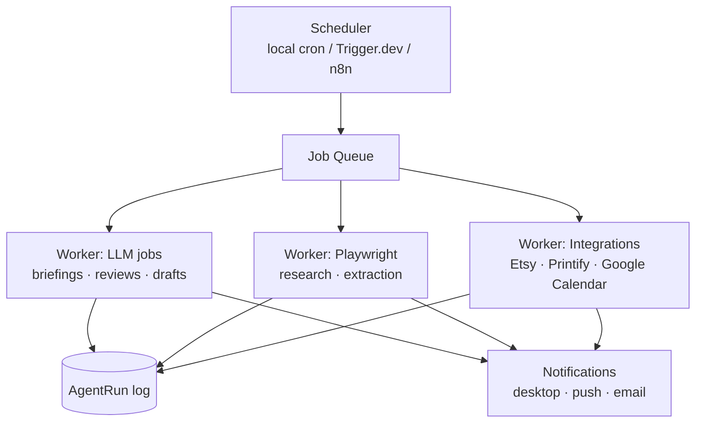

# 05 — Automation Architecture

Automation = **scheduled jobs** (time-driven) + **workflows** (event/intent-driven) executed by the Browser, Desktop, and Coding agents. Native APIs are always preferred over UI automation; UI automation is the fallback when no API exists, and always respects platform terms of service.

## Job scheduler

### Standard job catalog

| Job | Schedule | What it does |
|---|---|---|
| Morning briefing | daily, after Fajr | schedule + prayer times + top-3 ROI tasks + money snapshot |
| Nightly summary | daily 21:30 | wins, misses, tomorrow preview, reflow missed blocks |
| Daily planning | daily 05:00 | Scheduler agent regenerates today's blocks |
| Weekly review | Sun 18:00 | pillar scorecards, habit streaks, ROI report |
| Monthly review | 1st, 18:00 | goals vs actuals, forecast update |
| Trend research | Mon/Thu | TikTok + Etsy trend scan → product ideas inbox |
| Listing drafts | Tue | Etsy agent drafts titles/tags/descriptions into the queue |
| Financial report | Fri | P&L by source, expense anomalies, tax set-aside |
| Workout plan | Sun | next week's gym + boxing plan from recent volume/readiness |

## Browser automation (Playwright)

- Persistent authenticated browser profile per platform.
- Every workflow is a typed script: `navigate → act → extract → verify → report`.
- **Read-only workflows** (research, analytics scraping of own dashboards, competitor pages) run autonomously.
- **Write workflows** (fill forms, upload files) stop at a review checkpoint before anything is submitted.
- Anything that **sends, publishes, purchases, or deletes** requires explicit user confirmation — the script pauses and surfaces a confirm card with a diff/preview.

## Integrations (API-first)

| Platform | Method | Used for |
|---|---|---|
| Etsy | Open API v3 | listings CRUD, orders, stats |
| Printify | REST API | product creation, mockups, publish to Etsy |
| Google Calendar | API | two-way schedule sync |
| TikTok Shop | official APIs where available; otherwise manual-assist flows (JARVIS prepares everything, user clicks post) | metrics, content prep |
| Anthropic / OpenAI / Gemini | provider-agnostic `LLMProvider` interface | all generation |

## Failure policy

- Retries with exponential backoff (3×) for transient failures.
- Any workflow that fails verification rolls back what it can and files a task: *"Automation X failed at step Y — needs attention."*
- All runs logged to `AgentRun`/`ToolCall` for the weekly review to mine.

**Status:** the in-app scheduler generates daily plans and briefings today (client-side). External job runners, Playwright workers, and platform integrations are Phases 3–5 of the roadmap.
